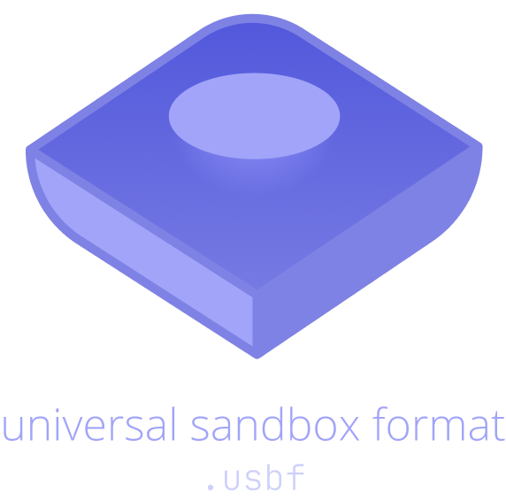

Convert builds between sandbox clones.

[devpixels.xyz](https://devpixels.xyz/)

---

test it out [here](https://universal-sb.devpixels.xyz)

This is a sandbox(roblox alternatives) file converter. It supports converting sandbox workshop's format to another, and vice versa.

## Compatibility Notice
Due to multiple sandbox workshop have different features they support. Only bricks(aka parts) can be exported right now.

## Supported Platforms
- Polytoria ^1.3 (.poly)
- Brick Hill ^0.2.0.0 (.brk)
- WorldToBuild ^15 (.wtbmap)
